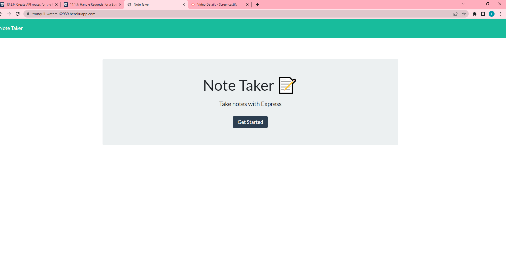
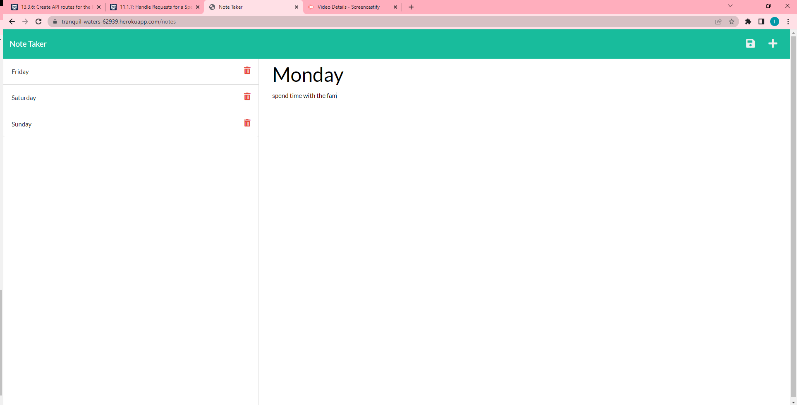

# Note Taker - Express.js

This application can be used to write, save, and delete notes entered by the user.  The front-end of this application was provided.  

*[Installation](#installation)    
*[Usage](#usage)     
*[Credits](#credits)

## Installation
This is uses Node.js.  Be sure and run npm install command in the terminal, while in root directory.  Run node server.js. and navigate to http://localhost:3001

## Usage

You can view Demo here at this link - [Screencastify](https://drive.google.com/file/d/1Af7cvQvfDh-DyOLdkSZk546iDmfToQpE/view)

[Heroku Link] (https://tranquil-waters-62939.herokuapp.com/)

## Credits
Inglish Foust
Coding Bootcamp for Front-End